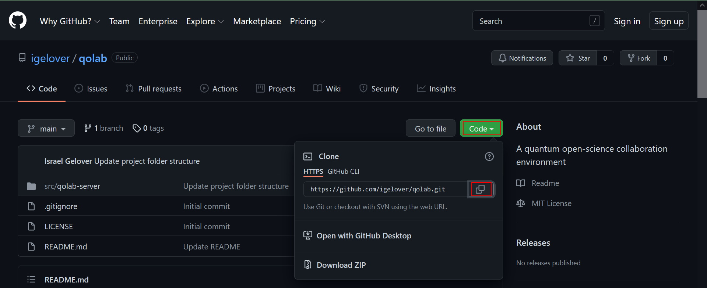
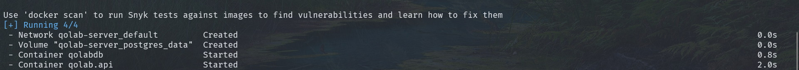
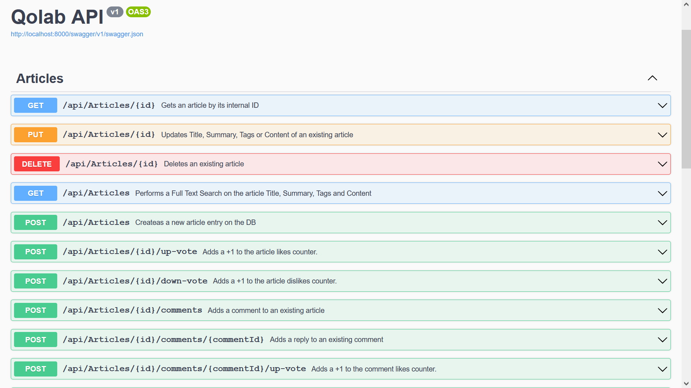

# Instructions to build and run the app

The following steps are similar no matter what your OS is. You only need to consider obvious differences on things like paths.

## Prerequisites

The application relies on Docker so you don't need to install extra software, but you may need to install Docker though. You can download Docker Desktop for Mac, Windows and Linux from [here](https://www.docker.com/products/docker-desktop).

## Clone Repository

First off you need to clone the repository from github. In order to do so, in the repository main page, click on the **Clone** button and then on the **Copy URL** button highlighted below.

On your terminal, run the following command

~~~
git clone https://github.com/igelover/qolab.git
~~~

Once the repository is cloned, you need to build the containers. In order to do so, inside the folder just created by git, change to the following folder

~~~
cd .\src\qolab-server\
~~~

And run this command

~~~
docker-compose up -d
~~~

It's going to take some time the firts time, it will download the container images and then build the containers, please be patient, the time will depend on your internet connection and your computer resources.

Wait until you see a confirmation message that all containers are up and running, similar to this

At this time, only the back-end is available and we'll update this document whith instructions to run the front-end when it becomes available.

In order to test the API, please open a browser and paste thsi URL

~~~
http://localhost:8000/swagger/index.html
~~~

There you can test the available enedpoint usgin swagger

